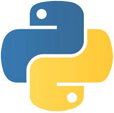
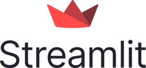

# Hi there!  I'm Somnath Kshirasagr - Your Data Scientist Extraordinaire! 🧑‍🔬🚀     

Welcome to my GitHub profile! Here, you'll find an overview of my skills, expertise, and a glimpse into my data-driven world. Feel free to explore and reach out to me if you have any questions or need assistance with your data science projects. Let's dive right in! 💡

## About Me ℹ️ 

I'm Somnath Kshirasagr, a passionate data scientist with a strong educational background. I hold a Bachelor's degree in Computer Science from Pune University, and I further honed my skills by pursuing a Master's degree in Data Science from Fergusson College. With my combined knowledge of computer science and data science, I'm well-equipped to tackle complex data challenges and extract meaningful insights from diverse datasets. Let's unleash the power of data together! 💪

## Skills and Expertise 🤓

Here's a list of my skills and areas of expertise that make me a versatile data scientist:

- **Python** 🐍: I'm highly proficient in Python, the powerhouse of the data science world. From data manipulation and preprocessing to building robust machine learning models, I leverage Python's extensive libraries and frameworks like NumPy, Pandas, and Scikit-learn to tackle data challenges efficiently.

- **Machine Learning** 🤖: I have a strong foundation in machine learning, encompassing various algorithms such as regression, classification, clustering, and ensemble methods. By leveraging techniques like feature engineering and model evaluation, I develop accurate and scalable machine learning models.

- **Deep Learning** 🧠: I specialize in deep learning, using frameworks such as TensorFlow and PyTorch to build and train neural networks for tasks like image recognition, natural language processing, and sequence generation. I'm passionate about leveraging the power of deep learning to unlock new insights from complex data.

- **Natural Language Processing (NLP)** 🗣️: I possess expertise in NLP, enabling me to work with unstructured text data effectively. Whether it's sentiment analysis, text classification, named entity recognition, or language generation, I apply cutting-edge NLP techniques to derive valuable insights from textual sources.

- **SQL and Database Management** 📊: I have hands-on experience working with SQL databases, enabling me to efficiently store, query, and analyze structured data. I'm proficient in writing complex SQL queries and optimizing database performance to extract meaningful information.

- **Power BI** 📈: I have mastered Power BI, a powerful business intelligence tool, to create visually appealing and interactive dashboards and reports. By transforming raw data into compelling visualizations, I help stakeholders make data-driven decisions and gain actionable insights.

- **Docker** 🐳: I have knowledge of containerization using Docker, allowing for seamless deployment and scalability of data science applications across different environments. By containerizing models and applications, I ensure consistency, reproducibility, and easy management.

- **API Development** 🌐: I'm skilled in developing APIs, including RESTful APIs and frameworks like FastAPI. This enables seamless integration of data science models into web applications, enabling real-time predictions, efficient data exchange, and building interactive data-driven applications.

- **AWS for Cloud Data Science** ☁️: I'm actively learning and leveraging Amazon Web Services (AWS) for cloud-based data science solutions. With AWS services like S3, EC2, and SageMaker, I'm able to harness the scalability and power of the cloud to tackle big data challenges.
-   ## ⚡ Technologies I use 

<table align="center">
    <tr>
        <td align="center" width="140" height="112.43">
            
              Python
        </td>
        <td align="center" width="140" height="112.43">
            
              Jupyter
        </td>
        <td align="center" width="140" height="112.43">
            
              TensorFlow
        </td>
        <td align="center" width="140" height="112.43">
            
              Pytorch
        </td>
        <td align="center" width="140" height="112.43">
            
              Scikit Learn
        </td>
        <td align="center" width="140" height="112.43">
            
              FastAPI
         </td>
        <td align="center" width="200" height="160">
            
              AWS Sagemaker
        </td>
         <td align="center" width="140" height="112.43">
            
              
        </td>
        <td align="center" width="140" height="112.43">
            
              Docker
        </td>
    </tr>
</table>

## Data Science Projects and Contributions 🚀

Here are some highlights from my data science journey, showcasing my ability to turn data into valuable insights:

- Developed end-to-end data science projects, starting from data acquisition and cleaning, to model development, and deploying them as web applications.
- Created a sentiment analysis model for social media data, providing valuable insights for brand reputation management.
- Implemented deep learning models for image recognition, achieving state-of-the-art accuracy in challenging competitions.
- Collaborated with cross-functional teams to build predictive models for demand forecasting, resulting in significant cost savings for retail companies.
- Actively contribute to the data science community by sharing my knowledge through blog posts and speaking at conferences and meetups.

## Let's Connect! 🤝

I'm always excited to collaborate, learn, and share my expertise with fellow data enthusiasts. If you have any questions, need assistance with your data science projects, or simply want to connect, feel free to reach out to me using the following channels:
## Contact Me

***Hit me up on any platform if you want to have a talk!***

Let's embark on a data-driven journey together and unleash the potential of your data! 🚀🔬💡
- 

An inch of time is an inch of gold, but you can't buy that inch of time with an inch of gold.
>----->----->----->----->----->----->
